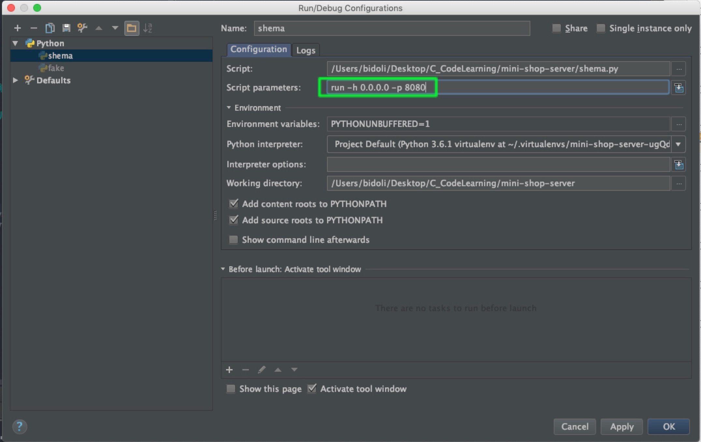
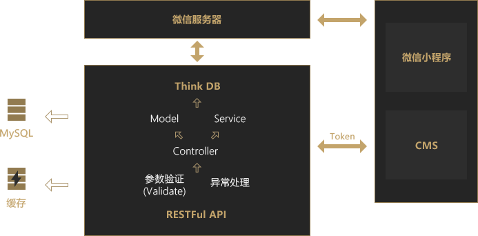
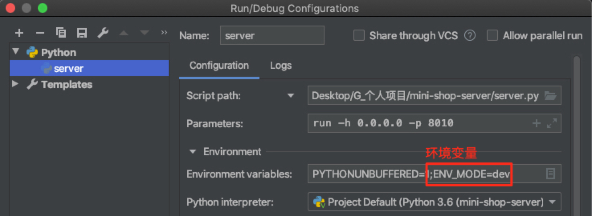

<h1 align="center">
  mini-shop-server
</h1>

<h4 align="center">
    构建微信小程序(商城)后端
    <br>🤜基于 Flask 框架🤛
</h4>

<div align="center">
  
  <div>
    <a href="http://47.114.33.143:9000/apidocs/#/" target="__blank">线上 API 文档</a>
  </div>
</div>

* 本项目的开发环境是 Mac OS，生产环境是 Linux Ubuntu 16.04
* 感谢慕课网的[七月老师](https://www.imooc.com/t/4294850)，本项目初期是基于他的课程思路

## 🎮 互动
QQ交流群:聊天、斗图、学习、交流，伸手党勿进

<table align="center">
  <tr>
    <td></td>
    <td></td>
  </tr>
  <tr>
    <td>
    <a target="_blank" href="//shang.qq.com/wpa/qunwpa?idkey=ee34348c8d177a4218594598de6c3fb404861a1c7a7091cd9f4384e6dcd6ea32"></a>
    </td>
    <td>
    <a target="_blank" href="//shang.qq.com/wpa/qunwpa?idkey=184ed5a00c7f903271f8d55beb814b7c9779347e114e2db51db7962bf9d016de"></a>
    </td>
  </tr>
  <tr>
  	<td>葬爱家族QQ交流群</td>
  	<td>林间有风团队官方QQ交流群</td>
  </tr>
</table>


## ✨ 亮点
- 基于原生的 Flask 构建 RESTful API
- 更灵活的 API文档生成方式(可带 **Token**)
- AOP(面向切面编程)设计，实现 **参数校验层** & **异常统一处理层**
- Ubuntu 16.04上 Nginx + Gunicorn + Pipenv部署

## 🔩 内置
1. 用户管理：提供用户的相关配置
2. 权限组(角色)管理：接口权限分配和菜单权限分配
3. 菜单管理：实现后端配置菜单动态路由，支持多级菜单
4. 字典管理：维护系统中经常使用的字典数据，如：性别，状态
5. 参数管理：系统动态配置常用参数，如：分页数，前端主题色等
6. 通知管理：系统通知&公告信息的发布维护
7. 日志管理：操作日志和登录日志
8. 接口文档：根据业务代码自动生成相关的api接口文档(Swagger风格)
9. 错误码：前后端开发的错误码的约定
10. 文件管理和上传：文件夹和文件的管理
11. 文章管理


## 目录
- [亮点](#亮点)
- [开发工具](#开发工具)
- [开发环境搭建](#开发环境搭建)
- [服务器部署](#服务器部署)
- [本地&线上同步推进](#本地&线上同步推进)：针对个人项目
- [上传&下载](#上传&下载)
- [骚操作](#骚操作)
- [三端分离](#三端分离): 后续
- [Nginx 部署](#nginx部署)
- [Python 学习路线](#Python学习路线)


## 开发工具
* Python 3.8（虚拟环境：pipenv）
* MySQL
* PyCharm（开发工具）
* Navicat（数据库可视化管理工具）

## 开发环境搭建
* MySQL安装、运行，数据库的导入
* Python 3.8

### MySQL的安装和数据导入
#### 一、安装
```
$ sudo apt-get install mysql-server
```
安装过程中，会让你输入密码。<br>
请务必记住密码!<br>
务必记住密码！<br>
记住密码！<br>

查看是否安装成功

```$ sudo netstat -tap | grep mysql```

#### 二、运行
```
$ mysql -u root -p # 执行完毕后输入密码
$ mysql -u root -p123456 # 直接输入密码，进入(我的密码是: 123456)
```

 **`-u`** 表示选择登陆的用户名，  **`-p`** 表示登陆的用户密码<br>
 上面命令输入之后，会提示输入密码(Enter password)

#### 三、导入
下载 MySQL数据  [SQL文件](https://server.mini-shop.ivinetrue.com/static/files/zerd.sql)

> mysql的每条执行以「分号」结尾
```
mysql> create database zerd; # 建立数据库(zerd)
mysql> use zerd; # 进入该数据库
mysql> source /home/ubuntu/mini-shop-server/zerd.sql; # 导入「mini-shop-server」目录下的sql文件
```
> Tips: 其他数据库操作<br>
```
// 1. 获取存在的所有表
show tables; 
// 2. 导入成功，可以直接查询(user表)
mysql> select * from user;
// 3. 删除数据库(zerd库)
mysql> drop database zerd;
// 4. 导出数据库
mysql> 
```


### Python3.8版本的安装
查询本地的python3的版本 ```$ python3 --version```
如果不是python3.8的版本，则如下操作

```
$ sudo apt-get update 
$ sudo apt-get install software-properties-common
$ sudo add-apt-repository ppa:jonathonf/python-3.8
$ sudo apt-get install python3.8
```

### pipenv的安装
如果还未安装pip3包管理工具，请先执行如下语句<br>
```$ sudo apt install python3-pip```

安装 pipenv<br>
```$ pip3 install pipenv```

> Tips: 其他 pipenv操作
```
$ pipenv install flask # 安装指定模块，并写入到 Pipfile中
$ pipenv install flask==2.0.3 # 安装指定版本的模块
$ pipenv uninstall flask # 卸载指定模块
$ pipenv update flask # 更新指定模块
$ pip list # 查看安装列表
$ pipenv graph # 查看安装列表，及其相应的以来
$ pipenv --venv # 虚拟环境信息
$ pipenv --py # Python解释器信息
$ pipenv --rm # 卸载当前虚拟环境
$ exit # 退出当前虚拟环境
```

### 本地启动
```
$ git clone https://github.com/Allen7D/mini-shop-server.git
$ cd mini-shop-server 
$ mkdir .venv # 在当前目录下生成.venv文件夹，用于存放该项目的python解释器(包括后续所有安装的包依赖)
$ pipenv --python 3.8 # 指定某 Python 版本创建环境
$ pipenv shell # 激活虚拟环境 or 如果没有虚拟环境，则构建新的(默认版本)
$ pipenv install # 安装生产环境的包依赖
$ pipenv install --dev # 安装开发环境的包依赖
$ python server.py run # 启动方式1:默认5000端口
$ python server.py run -p 8080 # 启动方式2:改为8080端口
$ python server.py run -h 0.0.0.0 -p 8080 # 启动方式3:以本地IP地址访问
```

### 生成临时管理员信息 
```$ python fake.py```

### Pycharm的配置<sup>[[1]](#ref_1)</sup>
Pycharm中 配置 Pipenv生成的虚拟环境，并使用 **`指定端口`** 开启「Debug模式」

1. 获取该虚拟环境下 Python的解释器的路径

<div align="center">
  
</div>

2. 配置指定端口号
**`Run > Edit Configurations`** <br>
写入 `run -h 0.0.0.0 8080` <br>
等同于，在终端执行 `python server.py run -h 0.0.0.0 -p 8080`

<div align="center">
  
</div>

3. 开启 Debug
**`Run > Debug 'server'`**

## 目录结构
<details>
<summary>展开查看</summary>
<pre><code>
.
├── app
│   ├── __init__.py
│   ├── api
│   │   ├── v1          # v1的API接口
│   │   │   ├── __init__.py
│   │   │   ├── address.py  # 用户地址
│   │   │   ├── banner.py   # 推广横幅
│   │   │   ├── category.py # 分类
│   │   │   ├── client.py
│   │   │   ├── order.py    # 订单
│   │   │   ├── pay.py      # 支付
│   │   │   ├── product.py  # 产品
│   │   │   ├── theme.py    # 主题
│   │   │   ├── token.py    # 令牌
│   │   │   └── user.py     # 用户
│   │   └── v2 # v2的API接口
│   │       ├── __init__.py
│   │       └── file.py     # 文件上传
│   ├── api_docs        # 对应的 API文档
│   ├── config # 配置文件
│   │   ├── secure.py
│   │   ├── setting.py
│   │   └── wx.py
│   ├── libs # 自己的库
│   │   ├── enums.py
│   │   ├── error.py
│   │   ├── error_code.py
│   │   ├── httper.py
│   │   ├── limiter.py
│   │   ├── redprint.py
│   │   ├── scope.py
│   │   ├── swagger_filed.py
│   │   ├── token_auth.py
│   │   └── utils.py
│   ├── models          # Model 层
│   ├── service # Service 层
│   │   ├── __init__.py
│   │   ├── app_token.py
│   │   ├── order.py
│   │   ├── pay.py
│   │   ├── token.py
│   │   └── wx_token.py
│   ├── validators      # 参数校验层
│   │   ├── __init__.py
│   │   ├── base.py
│   │   ├── forms.py
│   │   └── params.py
│   ├── web             # 网页文件
│   │   ├── __init__.py
│   │   └── auth.py
│   └── app.py
├── fake.py             # 生成临时用户
├── server.py           # 启动程序(项目入口)
├── config.ini
├── Pipfile             # 包依赖文件
├── code.md             # 错误码(用于前后端开发)
├── README.md           # 项目说明文档
├── zerd.sql
└── LICENSE
</code></pre>
</details>

### 开发思路
业务逻辑主要放在 Model 层
<div align="center">
  
  <p>项目架构体系</p>
</div>

### 业务逻辑分成
DAO层(数据访问层)，全称为data access object
<br>属于一种比较底层，比较基础的操作，对于数据库的操作，具体到对于某个表的增删改查。
<br>DAO一定是和数据库的某一张表一一对应的，其中封装了增删改查基本操作，建议DAO只做原子操作，增删改查。

Service层(服务层)
<br>是对一个或多个DAO进行的再次封装，封装成一个服务，因此不只是一个原子操作，需要事务控制。  

Controller层(业务层)
<br>管理用户的操作，用户界面传过的请求，调用对应的服务（service），完成用户请求的处理.

### 自动生成 api 接口文档
[Swagger](https://swagger.io/) 是一个规范和完整的框架，用于生成、描述、调用和可视化 RESTful风格的 Web 服务。

本项目使用 [Flasgger库](https://github.com/rochacbruno/flasgger)自动生成 Swagger 风格[(Demo)](https://editor.swagger.io/?_ga=2.211085136.492521077.1539840591-1920768432.1536803925)的API文档。

1. [Swagger Editor](http://editor.swagger.io/) 在网页端直接编辑 API 文档

查阅 API文档(本项目)
> 启动服务(DEBUG 模式下)<br>
在浏览器端输入：http://localhost:8080/apidocs/#/

#### 使用 Token
基于 HTTPBasicAuth 来传递token<br>
所以, Postman 中 Authorization 设置使用 Basic Auth;<br>
Flassger 中 securityDefinitions 设置使用 basicAuth (详见config/setting.py)

## 服务器部署
本项目选择在 Ubuntu 16.04 上，用 Nginx + Gunicorn + Pipenv 部署<sup>[[3]](#ref_3)</sup>，其中 Gunicorn 取代 uWsgi。
> Flask 与 uWsgi 结合有许多难以处理的 bug


### 运行
```
gunicorn -w 4 -b 127.0.0.1:8080 server:app # 在8080端口开启 gunicorn
fuser -k 8080/tcp # 关闭占用8080端口的服务
```

## 本地&线上同步推进
### 业务场景
本地与线上的 Swagger API 文档的接口的地址是不同的，但都依赖同一个配置文件 **`app\config\setting.py`**。<br>
而个人项目有着本地和线上同步，开发和测试同步的需求，会不断修改 **`app\config\setting.py`** 文件。 

### 解决
**`本地`** 和 **`线上`** 自动根据所处的环境变量「ENV_MODE」决定，选择不同的配置文件。
- 'dev:local'(local development 本地开发环境) 
- 'dev'(development 开发环境 ) 
- 'prod'(product 生产环境)

<div align="center">
  
</div>

1. PyCharm的状态栏的「Run > Edit Configurations」中编辑环境变量<br>
2. 设置ENV_MODE=dev:local<br>
3. 代码


## 上传&下载
### 上传<sup>[[2]](#ref_2)</sup>
具体查看 **`app/api/v2/file.py`** 的 **`upload_file`** 视图函数

### 下载
#### 1. 「静态资源文件」下载

默认下载路径前缀 **`http://0.0.0.0:8080/static/`**
访问 **`app/static/images`** 目录下的资源
```
http://0.0.0.0:8080/static/images/1@theme.png
```
访问 **`app/static/files`** 目录下的资源
```
http://0.0.0.0:8080/static/files/Python面向对象编程指南.epub
```


###对第三方库的装饰器的扩展
具体查看 **`app/lib/redprint.py`** 的 **`doc`** 函数

不改动第三方库 Flasgger的 swag_from(装饰器函数)的源码，对其进行了功能的扩展


## Nginx 部署

```
$ nginx -s stop # 停止 nginx
$ nginx -s reload # 重启 nginx
```

### Nginx 配置
建立 **`文件A`** 快捷方式 **`文件B`** : `ln –s 源文件A 目标文件B` <br>
以 `/etc/nginx/sites-available/server` 为源文件，以 `/etc/nginx/sites-enabled/server` 为目标文件，使得2个文件同步。<br>
`ln -s /etc/nginx/sites-available/server /etc/nginx/sites-enabled/server` 

`/etc/nginx/sites-available/server` 配置如下:
```bash
server {
    listen 443 default;
    server_name www.ivinetrue.com ivinetrue.com; 
    ssl on;
    root html;
    index index.html index.htm;
    access_log /var/log/nginx/access.log;
    error_log /var/log/nginx/error.log;
    ssl_certificate cert/ivinetrue.pem;
    ssl_certificate_key cert/ivinetrue.key;
    ssl_session_timeout 10m;
    ssl_ciphers ECDHE-RSA-AES128-GCM-SHA256:ECDHE:ECDH:AES:HIGH:!NULL:!aNULL:!MD5:!ADH:!RC4;
    ssl_protocols TLSv1 TLSv1.1 TLSv1.2;
    ssl_prefer_server_ciphers on;
    location / {
        include proxy_params;
        proxy_pass http://unix:/home/workspace/mini-shop-server/server.sock;
        # proxy_pass http://127.0.0.1:8080; # 弃用
        proxy_redirect off;
        proxy_set_header Host $host;
        proxy_set_header X-Real-IP $remote_addr;
        proxy_set_header X-Forwarded-For $proxy_add_x_forwarded_for;
        proxy_headers_hash_max_size 51200;
        proxy_headers_hash_bucket_size 6400;
    }
    location /static/ {
        alias /home/workspace/mini-shop-server/app/static/; # 静态资源文件路径
    }

}

server {
      listen  80;
      server_name www.ivinetrue.com ivinetrue.com;
      rewrite ^(.*)$  https://$host$1 permanent; # https 代理
}

```

### Nginx 其他配置
Nginx 的公共配置(例如: gzip)需要修改 `/etc/nginx/nginx.conf`

## supervisor 配置
路径 `/etc/supervisor/conf.d/server.conf`

配置文件

```bash
[program:server]
environment=PATH='/root/.local/share/virtualenvs/server-4o3oDD8t/bin/python'
command = /root/.local/share/virtualenvs/server-4o3oDD8t/bin/gunicorn -w 4 -b unix:/home/workspace/morning-star/server/server.sock server:app
directory = /home/workspace/morning-star/server
user = root
#日志输出
stderr_logfile=/tmp/blog_stderr.log
stdout_logfile=/tmp/blog_stdout.log
```

运行`supervisorctl restart server`

## 使用

### 第一步: 

### 第二步:

### 第三步: 


## 后续
### 三端分离
#### 1.客户端: mini-shop-wx
微信小程序n[链接](https://github.com/Allen7D/mini-shop-wx)。

#### 2.服务端: mini-shop-server
基于 Flask框架构建 RESTful API。

点击查阅 [API文档](http://118.25.25.229/apidocs/#/)(Swagger风格)

#### 3.CMS: mini-shop-cms
基于 Vue.js框架和Element-UI组件库 [链接](https://github.com/Allen7D/mini-shop-cms)

## Python3 学习路线(亲测)
路线: 1 -> 2 -> 3 -> 4

1. [《全面系统 Python3 入门+进阶课程》](https://coding.imooc.com/class/136.html) 
2. [《Python Flask 高级编程》](https://coding.imooc.com/class/194.html)
3. [《Python Flask 构建可扩展的 RESTful API》](https://coding.imooc.com/class/220.html)
4. [《微信小程序商城构建全栈应用》](https://coding.imooc.com/class/97.html)


## 参考
【1】<span id="ref_1"></span>[PyCharm配置使用Flask-Script启动以及开启Debug模式](http://www.it610.com/article/4325344.htm)

【2】<span id="ref_2"></span>[Flask 上传文件](https://dormousehole.readthedocs.io/en/latest/patterns/fileuploads.html)

【3】<span id="ref_3"></span>[Flask + Gunicorn + Nginx 部署](https://www.cnblogs.com/Ray-liang/p/4837850.html)

【4】<span id="ref_4"></span>[centos7 下通过nginx+uwsgi部署django应用](http://projectsedu.com/2017/08/15/centos7-%E4%B8%8B%E9%80%9A%E8%BF%87nginx-uwsgi%E9%83%A8%E7%BD%B2django%E5%BA%94%E7%94%A8/)

【5】<span id="ref_5"></span>[Nginx的https配置记录以及http强制跳转到https的方法梳理](https://www.cnblogs.com/kevingrace/p/6187072.html)

【6】<span id="ref_6"></span>[Nginx配置HTTPS](https://blog.csdn.net/cloume/article/details/78252319)

【7】<span id="ref_7"></span>[Linux下导入、导出mysql数据库命令的实现方法](https://www.jb51.net/article/131791.htm)

【8】<span id="ref_8"></span>[Automatically enable HTTPS on your website with EFF's Certbot.](https://certbot.eff.org/lets-encrypt/ubuntuxenial-nginx)

【9】<span id="ref_9"></span>[ubuntu16.04 64bit 升级 python3.5 python3.6](https://blog.csdn.net/zhao__zhen/article/details/81584933)

【10】[Lin-CMS](http://doc.cms.7yue.pro/)：优秀的 Flask & Vue 结合的前后端分离的 CMS 解决方案

【11】[基于Linux环境搭建Nginx+uWSGI+Python框](https://segmentfault.com/a/1190000012918535?utm_medium=referral&utm_source=tuicool)


